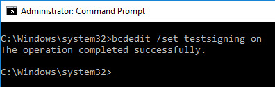

# Universal Watermark Disabler 

## 0x0 - Introduction
After developing a fascination for windows rootkits and therefore kernel mode drivers, i came across the fact that you [need to active the test-signing mode](https://learn.microsoft.com/en-us/windows-hardware/drivers/install/installing-an-unsigned-driver-during-development-and-test) to load your malicious driver. (Assuming that there is no exploit, allowing you to bypass this rule)

Activating the mentioned mode, however, has an rather ugly side-effect: 

A watermark appears and sullies the bottom right corner of the beautiful Windows default-wallpaper, which may encourage one or the other user to panic. Since this is the last a thing a stealthy rootkit wants to happen, I wondered if something could be done to let this water mark *magically disappear.*

A google search granted me the great honor to discover the so-called *[Universal Watermark Disabler (UWD)](https://winaero.com/download-universal-watermark-disabler/)*, which frankly seemed more than sketchy. **(Not sketchy enough for a fresh Windows 10 Virtual Machine)**

After executing the software and after resigning-in, it turned out that the software kept its promise and that the watermark was gone while the test-signing mode was enabled

I wasn't satisfied however, I wanted to know how the software did what it did *(And if there was malicious side-activity)*, so I thought that this would be a great start for me to get into reverse-engineering.

## 0x1 - Monitoring the Software

After looking into ways to monitor a software's activity, I stumbled across the [Process Monitor](https://learn.microsoft.com/en-us/sysinternals/downloads/procmon), which is a monitoring tool for Windows. It is able to monitor following things of every currently running user process:

- *Registry Activity **(e.g. Registry keys queried)***
- *File System Activity **(e.g. Read/Write activities)***
- *Network Activity **(e.g. Packets sent / Received)***
- *Process / Thread Activity **(e.g. Threads created, Processes started)***
- *Profiling Events **(Amount of processor time used by each process)***

To clean up the mess, I applied a filter that specifically filtered out the activities from the watermark remover *uwd.exe*.

After that, everything was set up and I executed the software.

### 0x11  Analysis

The first thing that I checked was the network-activity. It turns out that the Software had no network-activity at all, ruling out the possibility that it's a RAT or is somehow connected to a C2 Server, which was a good start.

*(Since the software requires administrative privileges, it could theoretically be extremely sophisticated and counter monitoring attempts by delaying the communication with a C2 server for some time, before activating itself. The main purpose of this write-up, however, is no the proof the legitimacy of the software, but to find out how the watermark is removed.)*

The interesting things happen when we take a look the the registry and file-system activity of the software.

Firstly, the software creates a new dll file called **painter_x64.dll** in the System32 directory. This file is the most important part of the software and servers as a proxy-dll for **explorerframe.dll**, which is used by **explorer.exe**. 

In order for **explorer.exe** to load **painter_x64.dll**, the CLSID entry of **explorerframe.exe** is replaced by the newly created dll file.

As you can see, the CLSID stays the same and thus belongs to **CLSID_ExplorerHostCreator**, however, the path of the corresponding executable is replaced by **painter_x64.dll**.

I am not quite sure why this approach for DLL-proxying is used, but I can imagine that other ways of doing it may cause Windows-Defender issues, as injecting other DLLs into **explorer.exe** may seen as problematic.

Here **painter_x64.dll** can be seen running in **explorer.exe**, confirming the analysis. 

In addition to that, a **dumpbin** dump also shows that the file proxies the needed functions to **explorerframe.dll** 

Now we know that DLL-proxying is used and how the DLL is loaded into **explorer.exe**. But one question still remains: *How does the newly created DLL prevent the text from being displayed?*

## 0x2 - Reverse Engineering
It is pretty clear that some function is getting hooked. Since I am new to Windows malware-development and the Windows-internals, I am not sure which one that would be.

I started to research on MSDN and Google, but I interrupted my search and chose a new approach.

To become really good at malware-development I figured that at some point, I would have to get into reverse engineering. And this was the moment.

So I installed [Ghidra](https://ghidra-sre.org/), watched a introduction Video on YouTube and got pretty much into it.

### 0x21 - Analysis 
After looking through the code and finding out what the different functions actually do, there was a part the stood out.

It turns out that a function called **ExtTextOutW** is getting hooked. If we take a look at the MSDN page of the function, it is pretty clear that this is the thing we were looking for:

### 0x22 - PoC
Even though it is pretty clear that this is definitely the function we were looking for, I wanted to proof it and play a little around with it.

The construction was pretty simple and firstly, I wanted to see if the watermark appears again after tweaking the function in such a way, that it's pretty much unhooked.

So after exporting the modified DLL, replacing the real one and restarting explorer, the watermark actually reappears, proofing that this is what we have been looking for.

Okay now this proofs it but it's pretty boring, right? Now let's do something more fun. Let's take a random string that can be found in the DLL and let's pass it as an argument for every ExtTextOutW call.

I found the String "Loaded", that was used somewhere in the DLL and passed it to the hooked **ExtTextOutW** function. Since it's an ASCII String and an UNICODE String is needed, surely something *interesting* will happen, right?

Yep, thats better. And this is something worth calling a PoC.

## 0x3 - Conclusion
Even though the Process Monitor activity of the Software seems to be okay and the DLL also seems to be legitimate and there are many sources vouching for the software, there is still an weird feeling when I execute it.

It's not open source and I still don't fully trust it, considering the fact that there is a whole executable (**uwd.exe**) that installs everything.

*I did open the exe in Ghidra, and I was able to decipher some parts, but I'm not nearly skilled enough to understand everything that is going on, especially because it seems to be coded in pascal, making everything in Ghidra even more confusing.*

*There is also a link in the executable that leads to a website that offers a Windows 7 Shell theme for Windows 10. And there is also a Russian alternative of the [site](https://startisback.com), which adds to the sketchiness. 

But I think that I am on a good way.

I will also probably release my own version of the Watermark remover, that works pretty much the same, but is open source.
